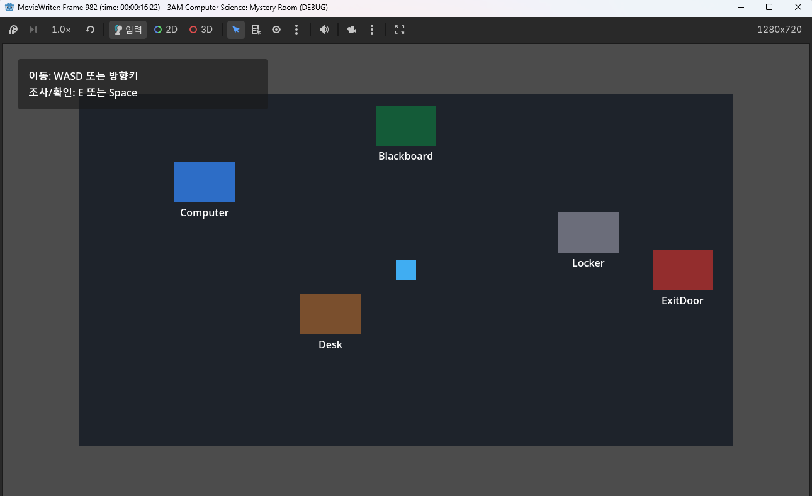
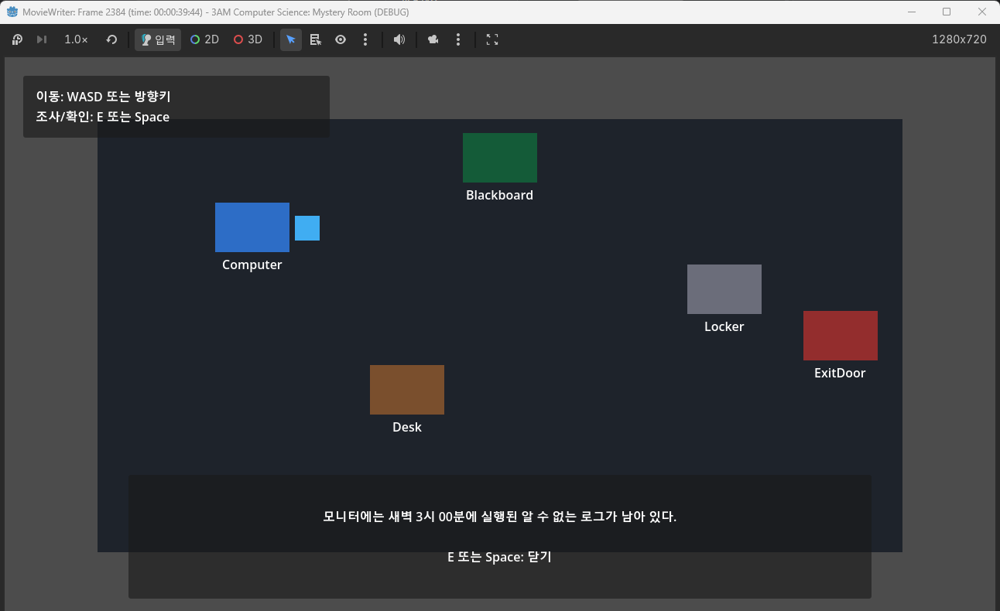
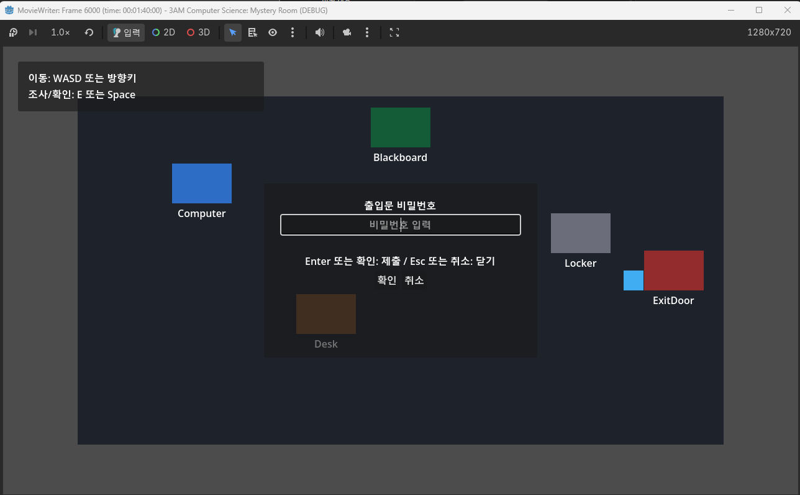
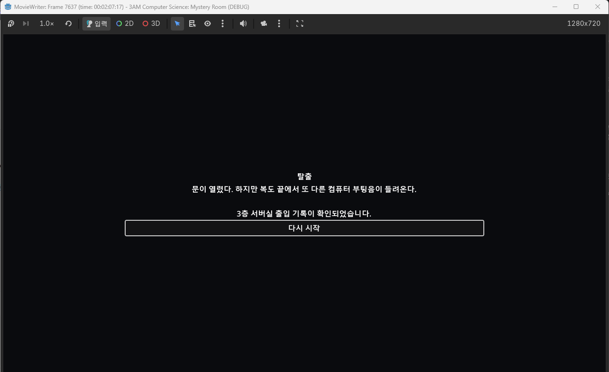

# 3AM Computer Science: Mystery Room

## 한국어 제목

새벽 3시, 컴퓨터공학과: 미스터리룸

## 프로젝트 개요

`3AM Computer Science: Mystery Room`은 Godot 4 기반의 짧은 2D 인터랙티브 미스터리 룸 게임임.

플레이어는 새벽 3시 컴퓨터공학과 실습실 안에서 깨어나고, 잠긴 공간을 조사하며 단서와 비밀번호를 찾아 탈출해야 함. 이 프로젝트는 추후 컴퓨터공학관을 배경으로 한 1인칭 호러 탐험 게임으로 확장할 수 있는 미스터리/호러 세계관의 첫 번째 프로토타입임.

현재 MVP는 실습실 탐색, 오브젝트 조사, 비밀번호 입력, 출입문 잠금 해제, 엔딩 전환, 다시 시작까지 하나의 짧은 플레이 흐름으로 연결됨.

## 현재 구현 상태

- Godot 4 기반 2D 탑다운 플레이 화면
- Player 이동
- LabRoom 충돌 경계
- 조사 오브젝트 5개
  - Computer
  - Blackboard
  - Desk
  - Locker
  - ExitDoor
- 조사 텍스트 UI
- 비밀번호 입력 UI
- 정답 비밀번호 `0300`
- ExitDoor 잠금/해제 상태
- Ending scene 전환
- 다시 시작 버튼
- 기본 조작 안내와 오브젝트 라벨

## 게임 플레이 흐름

1. 실습실에서 시작함.
2. 컴퓨터, 칠판, 책상, 사물함, 출입문을 조사함.
3. ExitDoor에서 비밀번호 입력 UI를 열음.
4. `0300` 입력으로 잠금을 해제함.
5. ExitDoor를 다시 조사함.
6. 엔딩 화면으로 전환됨.
7. 다시 시작 버튼으로 `Main.tscn`으로 돌아갈 수 있음.

## 조작법

| 동작 | 입력 |
| --- | --- |
| 이동 | `WASD` 또는 방향키 |
| 조사/확인 | `E` 또는 `Space` |
| 대화 닫기 | `E` 또는 `Space` |
| 비밀번호 제출 | `Enter` 또는 확인 버튼 |
| 비밀번호 입력 취소 | `Esc` 또는 취소 버튼 |
| 다시 시작 | 엔딩 화면의 다시 시작 버튼 |

## 주요 기능

- 2D 실습실 탐색
- 벽 충돌 처리
- 가까운 조사 오브젝트 감지
- 조사 텍스트 표시와 닫기
- 숫자 기반 비밀번호 입력
- 오답/정답 피드백
- 출입문 잠금 해제 상태 관리
- 엔딩 화면 전환
- 다시 시작 흐름

## 스크린샷

| 장면 | 이미지 |
| --- | --- |
| 실습실 전체 화면 |  |
| 조사 텍스트 UI |  |
| 비밀번호 입력 UI |  |
| 엔딩 화면 |  |

원본 스크린샷은 `screenshots/raw/`에 보관함. README 삽입용 대표 이미지는 `screenshots/readme/`에 영문 파일명으로 정리함.

## 개발 환경

- Engine: Godot 4.x
- Language: GDScript
- Genre: 2D interactive mystery room
- Target platform: Windows
- Version control: Git / GitHub
- Main editor: Visual Studio Code
- Godot extension: godot-tools
- Git helper extension: GitLens

## 실행 방법

1. Godot 4.x 실행
2. `project.godot` 프로젝트 열기
3. `scenes/main/Main.tscn` 실행 또는 프로젝트 실행
4. 실습실에서 오브젝트를 조사하고 ExitDoor 비밀번호 입력

## 프로젝트 구조

```text
.
├── assets/
│   ├── art/
│   ├── audio/
│   └── fonts/
├── scenes/
│   ├── main/
│   ├── objects/
│   ├── player/
│   ├── rooms/
│   └── ui/
├── scripts/
│   ├── core/
│   ├── objects/
│   ├── player/
│   └── ui/
├── docs/
│   ├── ai-simulation-logs/
│   ├── asset-credits.md
│   ├── development-log.md
│   └── game-design-document.md
├── screenshots/
│   ├── raw/
│   └── readme/
├── AGENTS.md
├── README.md
├── .gitignore
└── project.godot
```

`builds/`는 내보낸 실행 파일과 패키지 파일을 보관하는 로컬 출력 폴더임. 빌드 결과물은 Git에 포함하지 않음.

## AI/Codex 활용 방식

- Codex를 사용해 기능 구현, GitHub Issue/PR 관리, AI 작업 로그 작성, 검증을 진행함.
- 작업 단위별 AI 로그는 `docs/ai-simulation-logs/`에 저장됨.
- 기능/씬/코드 변경은 Issue + 작업 브랜치 + PR 방식으로 진행함.
- 낮은 위험의 문서/로그/메타데이터 작업은 AGENTS.md 기준에 따라 main 직접 커밋이 가능하도록 운영 규칙을 정리함.

## 현재 미구현 또는 향후 작업

- README용 플레이 영상 또는 GIF 추가
- Windows export 설정
- itch.io 업로드 준비
- 최종 보고서/포트폴리오 문서 정리
- 사운드와 간단한 연출 추가
- 외부 에셋 사용 시 크레딧 정리
- 향후 1인칭 호러 탐험 프로젝트로 확장 검토

## 라이선스/에셋 상태

- 현재 외부 에셋은 추가하지 않음.
- 화면에 보이는 그래픽은 Godot 기본 노드와 단순 도형 기반 임시 표현임.
- README 스크린샷은 이 저장소의 현재 Godot 프로젝트 실행 화면을 캡처한 문서용 이미지임.
- 별도 라이선스 파일은 아직 추가하지 않음.
